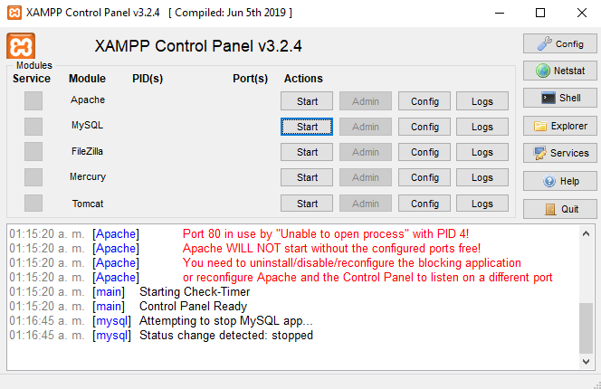
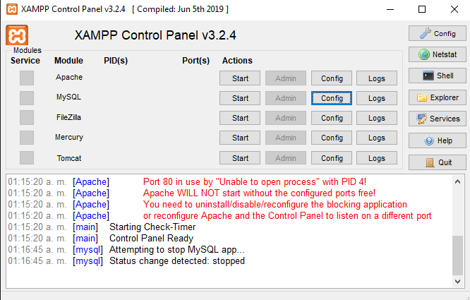
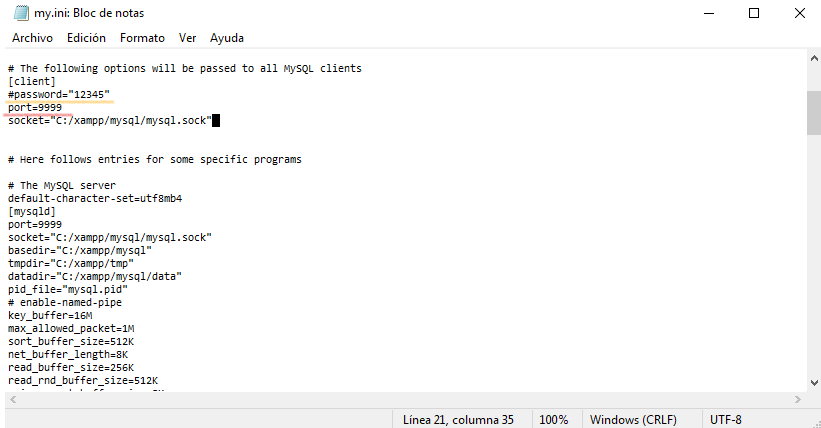

# Proyecto Final - Aplicacion Abarrotes

### Requerimientos
Estos son los programas que se necesita para poder ejecutar el proyecto.
* XAMPP

### Preparar XAMPP
Para probar el programa primero necesitas correr el programa XAMPP para arrancar la base de datos MySQL que es necesaria para el programa, se te mostrara la interfaz donde aparecen las siguientes opciones:

Si XAMPP abre correctamente aparecera como se ve en la imagen anterior. Para empezar a configurar XAMPP para ejecutar el proyecto, tienes que hacer presionar el boton que dice "condig", el cual aparece resaltado en azul en la siguiente imagen:

Al hacer click se mostrara un pequeño dialogo que dice algo como "my.ini" y debajo como "Browse", en este caso seleccionaremos el primero, el que dice "my.ini". Este archivo es el archivo que contiene la configuracion para que arranque nuestro servicio de MySQL, para ejecutar la aplicacion debemos modificar ciertas variables en el archivo, como la variable del puerto y la de contraseña, el puerto lo cambiaremos al puerto 9999 que es necesario para que no tengas que modificar los scripts de instalacion (el *launch.bat*). Se te mostrara al presionar "my.ini" la siguiente ventana del bloc de notas:

En este caso de la imagen, los datos ya se encuentran modificados, en caso de que tengas un puerto diferente asignado a esa variable, debes cambiarlo al puerto 9999, y en la contraseña debes de añadir el caracter "#" al inicio de la linea de la contraseña, esto es para que no se tenga ninguna restriccion a la hora de trabajar con la base de datos. Cuando termines de guardar el archivo de configuracion en el bloc de notas, se cerrara el bloc de notas y estara listo para arrancar MySQL. Para arrancar MySQL tienes que presionar el boton que dice "Start" en la fila que dice "MySQL", despues de presionarlo, esa fila se debe poner en color verde y mostrar el puerto que le asignaste en el archivo de configuracion "my.ini". Debe mostrarse algo como:

### Ejecutar
Para ejecutar la aplicacion "AplicacionAbarrotes" debes primero preparar XAMPP, configurarla en el puerto **9999** y arrancar la base de datos MySQL, despues tienes que ejecutar el archivo .bat llamado **"launch.bat"** que se encuentra en la carpeta del proyecto, este archivo se encarga de crear la base de datos **abarrotes** si no existe, crear las tablas necesarias para la aplicacion (si no existen) e insertar
datos de prueba en la base de datos. Basta con presionar el archivo con doble-click, se desplegara una terminal CMD que te mostrara los mensajes de la operacion, en caso de que
todo salga bien, se mostrara: 
> Se creo la base de datos...

El archivo **"launch.bat"** busca si se encuentra un archivo JAR ejecutable de la aplicacion en la carpeta del proyecto (en la carpeta **dist**), si la encuentra, la aplicacion se ejecuta desde este archivo JAR justo despues de terminar la preparacion de la base de datos. En caso de no encontrarlo, muestra el mensaje:
> Ya puedes ejecutar el programa desde tu NetBeans 8...

### Por hacer (PRIMER AVANCE) (TODOs) 
- [x] Definir el primer diseño (PROTOTIPO) de la base de datos (definir los roles del usuario de la aplicacion y las llaves foraneas de las tablas en SQL) *[Jesus, para el 6 de Noviembre, maximo el 8 de Noviembre]*.
- [x] Crear la libreria final que se conecta a la base de datos *[Saul, para el 6 de Noviembre]*.
- [ ] Modificar la libreria **AbarrotesDAO** para que trabaje sobre la base de datos *[Saul, para el 8 de Noviembre, maximo el 10 de Noviembre]*
  - [x] Productos
  - [x] Usuarios
  - [ ] Productos Empacados
  - [ ] Productos a Granel
  - [ ] Movimientos Productos Empacados
  - [ ] Movimientos Productos a Granel
- [ ] Hacer las **PRUEBAS UNITARIAS** de la nueva libreria modificada **AbarrotesDAO** [Damian, necesita **AbarrotesDAO** actualizado para realizarlo, maximo para el 10 de Noviembre].
- [ ] Hacer la interfaz de **Login** y de **Registro** de la aplicacion *[Nomar, para el 9 de Noviembre]*.
- [ ] Añadirle funcionalidad al **Login** (Validacion con expresiones regulares en campos y busqueda en base de datos) *[Nomar, para el 13 de Noviembre]*.
- [ ] Realizar pruebas al **Login** y **registro** *[Damian, maximo ANTES DEl 15 DE NOVIEMBRE]*.
### Por hacer (FINAL)
- [ ] Documentacion completa, manual, diagramas UML y de relaciones de la base de datos *[Diana, necesario 7 dias antes de la entrega del proyecto para revision]*

